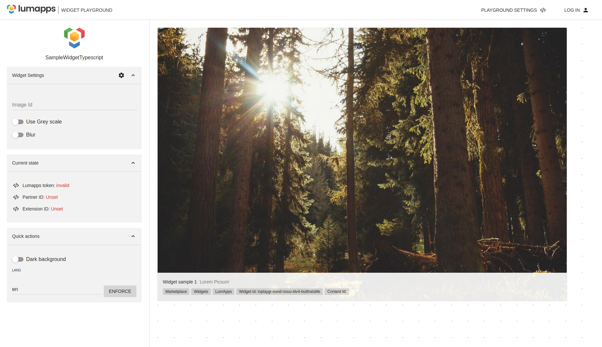

# LumApps Extensions Playground

<h6>Table of Contents</h6>

- [LumApps Extensions Playground](#lumapps-extensions-playground)
  - [Create a project](#create-a-project)
  - [Playground interfaces](#playground-interfaces)
    - [Local Test](#local-test)
    - [Login](#login)
    - [Deployment manager](#deployment-manager)
    - [Back Office interface](#back-office-interface)
      - [Extensions manager](#extensions-manager)
  - [Troubleshooting](#troubleshooting)

The LumApps Extensions Playground allow Extension developers to develop and test their extension  quickly, easily and locally. It's a ReactJs based application that you can import on your machine. It lets you connect your extension with your LumApps test platform.

You use the Playground to create and run an extension project, using either your own extension code or example templates. An extension project is a combination of an extension manifest (metadata) and extension code.

## Create a project
1. Install the LumApps extension template, a library to kickstart your extensions : 
   - https://github.com/lumapps/lumapps-extensions-templates
2. Run the create lumapps-extension script to retrieve the Extensions Playground application and a sample extension.
3. install the needed dependencies
   - `yarn`
4. Run the playground
    - `yarn start`

## Playground interfaces

The Playground offer multiple features to help you develop, test, and interact with the LumApps Marketplace environment.

### Local Test
The Playground is basically made to offer a Local Test environment for your extension. This local environment emulate a LumApps platform to let you render and connect your extension parts. From there you can test all parts of your extension and see if its work as expected all together.

To emulate a LumApps platform you can use some options such as the Theme switcher to visualize your extension with a Ligh or Dark Theme, and a language field to test the translations of your extension.

### Login
The Playground allow you to signin to your LumApps test platform with your credentials. Once logged in, your account is used by the SDK to emulate the current connected user. The login feature give you acces to administration feature within the Playground.

### Deployment manager

With your LumApps test platform account you can proceed to deployment of your extension in your LumApps test platform. It will publish your extension on your test platform.

To perform this deployment you'll have to open the Playground settings dialog. 

If it's the first time you deploy your extension in your LumApps test platform, you'll have to declare your extension in the LumApps Test Marketplace by using the `Claim Extension ID` interface. It will use the information defined in your extension manifest to declare your extension.

Once declared, save the Extension ID, in the manifest of your extension to perform next actions.

Once your extension is declared in the Test Marketplace, you can build your extension using the `Build & Deploy` interface. The build process will generate the Extension's Bundles, one per Extension Part (Content, Settings and Global Settings) and a `versionBump.json` file depending on the kind of bump you want to do. 

For the Hosted Test environment, you'll have to store the Extensions Bundles in a server or CDN accessible online with using **HTTPS**, and allowing **CORS** to be reached by your LumApps test platform.

Once your bundles are stored, you can deploy your extension. You'll have to define the public link used by the platform to reach your Extension's Bundles (eg : `https://my-server/my-extension/my-version`).

After this operation the version of your extension is available on your LumApps test platform.

### Back Office interface
If you are logged in, you can access to a back office interface. You can access this interface by clicking on your name and selecting `Back office` on the menu.

#### Extensions manager

In this view, you will find all the extensions you already deployed on you LumApps test platform.

## Troubleshooting

